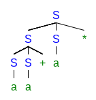
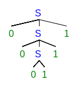
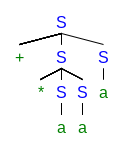
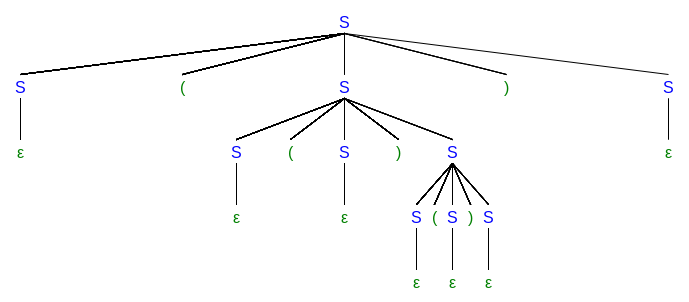
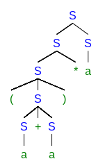
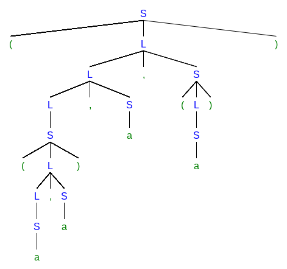

# Context-free Grammars

## Exercise 4.2.1

Consider the context-free grammar:

and the string aa+a*.

a) Give a leftmost derivation for the string.

b) Give a rightmost derivation for the string.

c) Give a parse tree for the string.

d) Is the grammar ambiguous or unambiguous? Justify your answer.

Unambiguous.

Since the derivation

generates a different sentence. If it is a sub-derivation of a larger one, the larger one will generate a different sentence as well.

e) Describe the language generated by this grammar. 

It is the postfix arithmetic expressions only with addition and multiplication.

## Exercise 4.2.2

Repeat Exercise 4.2.1 for each of the following grammars and strings:

a)  with string 000111.

The leftmost derivation is the same as the rightmost derivation.

Obviously, the grammar is unambiguous. It represents strings a sequence of zeros followed by the same number of ones.

b)  with string +*aaa.

The leftmost derivation is as follows:

The rightmost derivation:

The grammar recognizes prefix arithmetic expressions involving only addition and multiplication.
It is unambiguous for the similar reason to [Exercise 4.2.1](#exercise-421)

c)  with string (()()).

The leftmost derivation:

The rightmost derivation:

This grammar is ambiguous, for example two different leftmost derivations leading to the same sentence:

Parenthesis-balanced strings can be generated by the grammar.

d)  with string (a+a)*a.

The leftmost derivation:

The rightmost derivation:

The grammar is ambiguous since two different leftmost derivations lead to the same sentence:

e)  and  with string ((a,a),a,(a)).

The leftmost derivation:

The rightmost derivation:

The grammar recognizes strings like tuples.

f)  with string aabbab

The leftmost derivation:

The rightmost derivation:

This grammar is ambiguous, and it can generate strings with equal number of a's and b's.

g) It is unambiguous, and recognizes boolean expressions.

## 4.2.3

Design grammars for the following languages:

a) The set of all strings of 0s and 1s such that every 0 is immediately
followed by at least one 1.

b) The set of all strings of 0s and 1s that are palindromes; that is,
the string reads the same backward as forward.

c) The set of all strings of 0s and 1s with an equal number of 0s and 1s.

d) The set of all strings of 0s and 1s with an unequal number of 0s and 1s.

e) The set of all strings of 0s and 1s in which 011 does not appear as a substring.

## 4.2.4

Proof:

 is equivalent to:

 is equivalent to:

## 4.2.5

I guess there is a mistake in the first production rule. If so, the simplified grammar is as follows

## 4.2.6

A regular expression can be converted into a context-free grammar.

## 4.2.7

A [solution](https://www.cs.scranton.edu/~mccloske/courses/cmps260/cfg_remove_useless.html) on the Internet.

