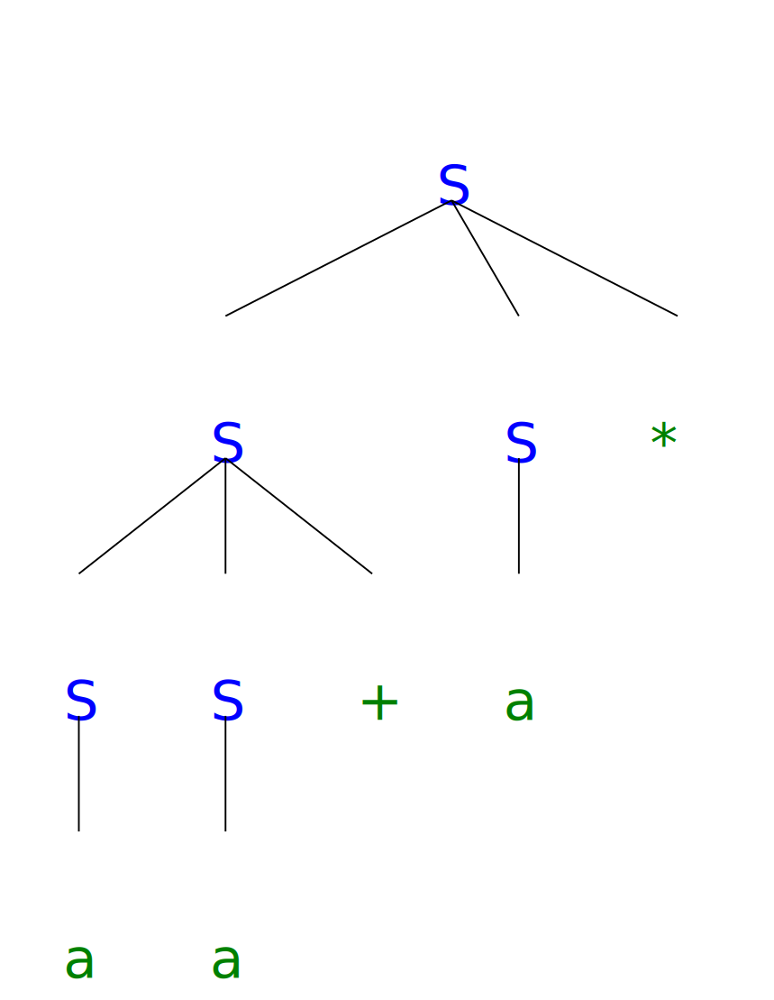

# Context-free Grammars

## Exercise 4.2.1

Consider the context-free grammar:

$$S \rightarrow SS+ | SS* | a$$

and the string aa+a*.

a) Give a leftmost derivation for the string.

$$S \Rightarrow SS* \Rightarrow SS+S* \Rightarrow aS+S* \Rightarrow aa+S* \Rightarrow aa+a*$$

b) Give a rightmost derivation for the string.

$$S \Rightarrow SS* \Rightarrow Sa* \Rightarrow SS+a* \Rightarrow Sa+a* \Rightarrow aa+a*$$

c) Give a parse tree for the string.

d) Is the grammar ambiguous or unambiguous? Justify your answer.

Unambiguous.

Since the derivation

$$S \Rightarrow SS+ \Rightarrow SS*S+ \Rightarrow aS*S+ \Rightarrow aa*S+ \Rightarrow aa*a+$$

generates a different sentence. If it is a sub-derivation of a larger one, the larger one will generate a different sentence as well.

e) Describe the language generated by this grammar.

It is the postfix arithmetic expressions only with addition and multiplication.

