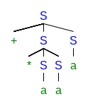
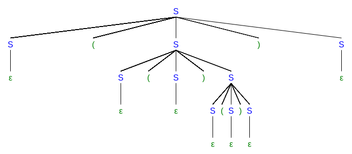
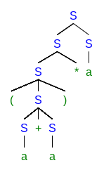
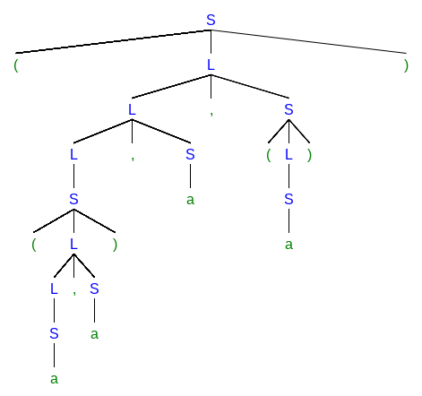

# Context-free Grammars

## Exercise 4.2.1

Consider the context-free grammar:

$$S \rightarrow SS+ | SS* | a$$

and the string aa+a*.

a) Give a leftmost derivation for the string.

$$S \Rightarrow SS* \Rightarrow SS+S* \Rightarrow aS+S* \Rightarrow aa+S* \Rightarrow aa+a*$$

b) Give a rightmost derivation for the string.

$$S \Rightarrow SS* \Rightarrow Sa* \Rightarrow SS+a* \Rightarrow Sa+a* \Rightarrow aa+a*$$

c) Give a parse tree for the string.

d) Is the grammar ambiguous or unambiguous? Justify your answer.

Unambiguous.

Since the derivation

$$S \Rightarrow SS+ \Rightarrow SS*S+ \Rightarrow aS*S+ \Rightarrow aa*S+ \Rightarrow aa*a+$$

generates a different sentence. If it is a sub-derivation of a larger one, the larger one will generate a different sentence as well.

e) Describe the language generated by this grammar. 

It is the postfix arithmetic expressions only with addition and multiplication.

## Exercise 4.2.2

Repeat Exercise 4.2.1 for each of the following grammars and strings:

a) $$S \rightarrow 0S1 | 01$$ with string 000111.

The leftmost derivation is the same as the rightmost derivation.

$$S \Rightarrow 0S1 \Rightarrow 00S11 \Rightarrow 000111 $$

Obviously, the grammar is unambiguous. It represents strings a sequence of zeros followed by the same number of ones.

b) $$S \rightarrow +SS | *SS | a$$ with string +*aaa.

The leftmost derivation is as follows:

$$S \Rightarrow +SS \Rightarrow +*SSS \Rightarrow +*aSS \Rightarrow +*aaS \Rightarrow +*aaa$$

The rightmost derivation:

$$S \Rightarrow +SS \Rightarrow +Sa \Rightarrow +*SSa \Rightarrow +*Saa \Rightarrow +*aaa$$

The grammar recognizes prefix arithmetic expressions involving only addition and multiplication.
It is unambiguous for the similar reason to [Exercise 4.2.1](#exercise-421)

c) $$S \rightarrow S(S)S | \epsilon$$ with string (()()).

The leftmost derivation:

$$S \Rightarrow S(S)S \Rightarrow (S)S \Rightarrow (S(S)S)S \Rightarrow ((S)S)S \Rightarrow (()S)S \Rightarrow (()S()S)S \Rightarrow (()()S)S \Rightarrow (()())S \Rightarrow (()())$$

The rightmost derivation:

$$S \Rightarrow S(S)S \Rightarrow S(S) \Rightarrow S(S(S)S) \Rightarrow S(S()) \Rightarrow S(S(S)S()) \Rightarrow S(S(S)()) \Rightarrow S(S()()) \Rightarrow S(()()) \Rightarrow (()()) $$

This grammar is ambiguous, for example two different leftmost derivations leading to the same sentence:

$$S \Rightarrow S(S)S \Rightarrow S(S)S(S)S \Rightarrow (S)S(S)S \Rightarrow ()S(S)S \Rightarrow ()(S)S \Rightarrow ()()S \Rightarrow ()()$$

$$S \Rightarrow S(S)S \Rightarrow (S)S \Rightarrow ()S \Rightarrow ()S(S)S \Rightarrow ()(S)S \Rightarrow ()()S \Rightarrow ()()$$

Parenthesis-balanced strings can be generated by the grammar.

d) $$S \rightarrow S+S | SS | (S) | S* | a$$ with string (a+a)*a.

The leftmost derivation:

$$S \Rightarrow SS \Rightarrow S*S \Rightarrow (S)*S \Rightarrow (S+S)*S \Rightarrow (a+S)*S \Rightarrow (a+a)*S \Rightarrow (a+a)*a$$

The rightmost derivation:

$$S \Rightarrow SS \Rightarrow Sa \Rightarrow S*a \Rightarrow (S)*a \Rightarrow (S+S)*a \Rightarrow (S+a)*a \Rightarrow (a+a)*a$$

The grammar is ambiguous since two different leftmost derivations lead to the same sentence:

$$S \Rightarrow SS \Rightarrow S+SS \Rightarrow a+SS \Rightarrow a+S*S \Rightarrow a+a*S \Rightarrow a+a*a$$

$$S \Rightarrow SS \Rightarrow S*S \Rightarrow S+S*S \Rightarrow a+S*S \Rightarrow a+a*S \Rightarrow a+a*a$$

e) $$S \rightarrow (L) | a$$ and $$L \rightarrow L,S | S$$ with string ((a,a),a,(a)).

The leftmost derivation:

$$S \Rightarrow (L) \Rightarrow (L,S) \Rightarrow (L,S,S) \Rightarrow (S,S,S) \Rightarrow ((L),S,S) \Rightarrow ((L,S),S,S) \Rightarrow ((S,S),S,S) \Rightarrow ((a,S),S,S) \Rightarrow ((a,a),S,S) \Rightarrow ((a,a),a,S) \Rightarrow ((a,a),a,(L)) \Rightarrow ((a,a),a,(S)) \Rightarrow ((a,a),a,(a))$$

The rightmost derivation:

$$S \Rightarrow (L) \Rightarrow (L,S) \Rightarrow (L,(L)) \Rightarrow (L,(S)) \Rightarrow (L,(a)) \Rightarrow (L,S,(a)) \Rightarrow (L,a,(a)) \Rightarrow (S,a,(a)) \Rightarrow ((L),a,(a)) \Rightarrow ((L,S),a,(a)) \Rightarrow ((L,a),a,(a)) \Rightarrow ((S,a),a,(a)) \Rightarrow ((a,a),a,(a))$$

The grammar recognizes strings like tuples.

f) $$S \rightarrow aSbS | bSaS | \epsilon$$ with string aabbab

The leftmost derivation:

$$S \Rightarrow aSbS \Rightarrow aaSbSbS \Rightarrow aabSbS \Rightarrow aabbS \Rightarrow aabbaSbS \Rightarrow aabbabS \Rightarrow aabbab$$

The rightmost derivation:

$$S \Rightarrow aSbS \Rightarrow aSbaSbS \Rightarrow aSbaSb \Rightarrow aSbab \Rightarrow aaSbSbab \Rightarrow aaSbbab \Rightarrow aabbab$$

This grammar is ambiguous, and it can generate strings with equal number of a's and b's.

g) It is unambiguous, and recognizes boolean expressions.

