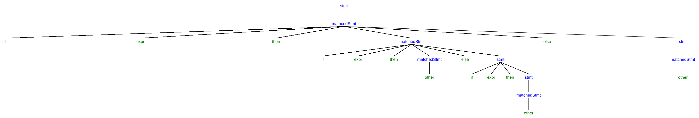

# Writing a Grammar

## 4.3.1

a) Left factor this grammar.

Doing left factoring makes no difference.

b) Does left factoring make the grammar suitable for top-down parsing?

No. Since left factoring does not change the original grammar, and
it is left recursive.

c) In addition to left factoring, eliminate left recursion from the original grammar.

d) Is the resulting grammar suitable for top-down parsing?

No. The resulting grammar is ambiguous.

## 4.3.2

a)

After left factoring:

The above grammar is not suitable for top-down parsing because it is left recursive.

After eliminating left recursion:

Then, this one is suitable for top-down parsing.

b)

After left factoring:

This grammar is suitable for top-down parsing.

After left recursion elimination:

The above one is suitable for top-down parsing.

c)

The grammar does not change after left factoring. And it is not suitable for
top-down parsing because it is left recursive.

After eliminating left recursion:

It is suitable for top-down parsing.

d)

Left factoring cannot be applied to the original grammar. It is not suitable for
top-down parsing because it is left recursive.

After left recursion elimination:

The above grammar is suitable for top-down parsing.

e)

Left factoring makes no difference. Besides, it is not suitable
for top-down parsing since it is left recursive.

After eliminating left recursion:

It is suitable for top-down parsing.

## 4.3.3

The grammar is still ambiguous because the following two parse tree can be
generated from the same sentence:

