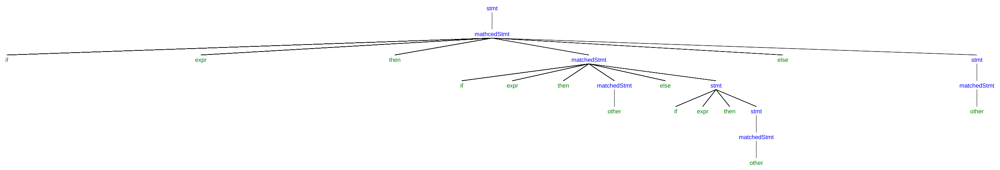
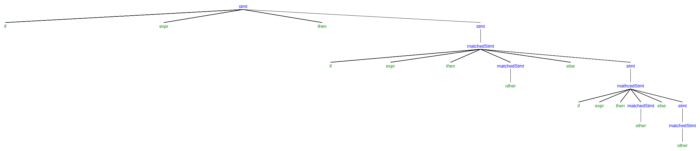

# Writing a Grammar

## 4.3.1

a) Left factor this grammar.

Doing left factoring makes no difference.

b) Does left factoring make the grammar suitable for top-down parsing?

No. Since left factoring does not change the original grammar, and
it is left recursive.

c) In addition to left factoring, eliminate left recursion from the original grammar.

$$
\begin{array}{lll}
rexpr & \rightarrow & rterm \ rexpr' \\
rexpr' & \rightarrow & + \ rterm \ rexpr' \ | \ \epsilon \\
rterm & \rightarrow & rfactor \ rterm \ | \ rfactor \\
rfactor & \rightarrow & rprimary \ rfactor' \\
rfactor' & \rightarrow & * \ rfactor' \ | \ \epsilon \\
rprimary & \rightarrow & {\bf a} \ | \ {\bf b}
\end{array}
$$

d) Is the resulting grammar suitable for top-down parsing?

No. The resulting grammar is ambiguous.

## 4.3.2

a)

After left factoring:

$$
\begin{array}{lll}
S & \rightarrow & SST | \ a \\
T & \rightarrow & + \ | \ *
\end
$$

The above grammar is not suitable for top-down parsing because it is left recursive.

After eliminating left recursion:

$$
\begin{array}{lll}
S & \rightarrow & a \ S' \\
S' & \rightarrow & STS' \ | \ \epsilon \\
T & \rightarrow & + \ | \ *
\end{array}
$$

Then, this one is suitable for top-down parsing.

b)

After left factoring:

$$
\begin{array}{lll}
S & \rightarrow & 0 \ T \\
T & \rightarrow & S \ 1 \ | \ 1
\end{array}
$$

This grammar is suitable for top-down parsing.

After left recursion elimination:

$$
\begin{array}{lll}
S & \rightarrow & 0 \ T \\
T & \rightarrow & 0 \ T \ 1 \ | \ 1
\end{array}
$$

The above one is suitable for top-down parsing.

c)

The grammar does not change after left factoring. And it is not suitable for
top-down parsing because it is left recursive.

After eliminating left recursion:

$$
\begin{array}{lll}
S & \rightarrow & (S)SS \ | \ \epsilon
\end{array}
$$

It is suitable for top-down parsing.

d)

Left factoring cannot be applied to the original grammar. It is not suitable for
top-down parsing because it is left recursive.

After left recursion elimination:

$$
\begin{array}{lll}
S & \rightarrow & (L) \ | \ a \\
L & \rightarrow & (L)L' \ | \ aL' \\
L' & \rightarrow & , SL' \ | \ \epsilon
\end{array}
$$

The above grammar is suitable for top-down parsing.

e)

Left factoring makes no difference. Besides, it is not suitable
for top-down parsing since it is left recursive.

After eliminating left recursion:

$$
\begin{array}{lll}
bexpr & \rightarrow & bterm \ bexpr' \\
bexpr' & \rightarrow & {\bf or} \ bterm \ bexpr' \ | \ \epsilon \\
bterm & \rightarrow & bfactor \ bterm' \\
bterm' & \rightarrow & {\bf and} \ bfactor \ bterm' \ | \ \epsilon \\
bfactor & \rightarrow & {\bf not} \ bfactor \ | \ (bexpr) \ | \ {\bf true} \ | \ {\bf false}
\end{array}
$$

It is suitable for top-down parsing.

## 4.3.3

The grammar is still ambiguous because the following two parse tree can be
generated from the same sentence:

