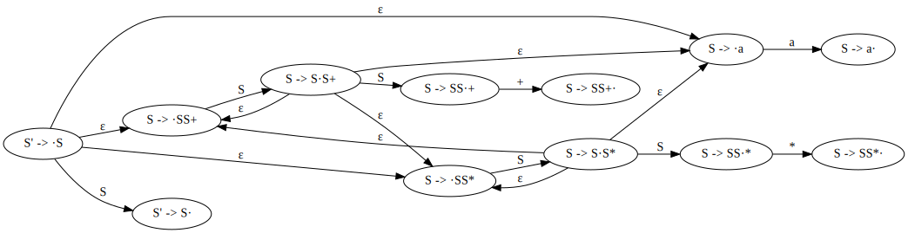

# Introduction to LR Parsing: Simple LR

## 4.6.1

Describe all the viable prefixes for the following grammars:

a) The grammar `S -> 0 S 1 | 0 1` of Exercise 4.2.2(a).

The viable prefixes are prefixes of strings represented by the regular expression
`0+S1`.

b) The grammar `S -> SS + | SS * | a` of Exercise 4.2.1.

An NFA for recognizing viable prefixes can be constructed according to pp.257.

The viable prefixes are prefixes of strings recognized by the regular expression
`S | S?a | S+S(\+ | \*)`

c) The grammar `S -> S (S) | ε` of Exercise 4.2.2(c).

The viable prefixes are prefixes of string accepted by the regular expression
`S((S\()+S\))?`

## 4.6.2

Construct the SLR sets of items for the (augmented) grammar of Exercise 4.2.1. Compute the GOTO function for these sets of items. Show the parsing table for this grammar. Is the grammar SLR?

| State         | Set of Items                                                                                  |
| ------------- | --------------------------------------------------------------------------------------------- |
| I0 | S' -> ·S   S -> ·SS+   S -> ·SS*   S -> ·a                                           |
| I1 | S' -> S·   S -> S·S+   S -> S·S*   S -> ·SS+   S -> ·SS*   S -> ·a             |
| I2 | S -> a·                                                                                       |
| I3 | S -> SS·+   S-> SS·*   S -> S·S+   S -> S·S*   S -> ·SS+   S -> ·SS* | S -> ·a |
| I4 | S -> SS+·                                                                                     |
| I5 | S -> SS*·                                                                                     |

| Symbol | FIRST | FOLLOW    |
| ------ | ----- | ------    |
| S      | {a}   | {a + * $} |

| State | a  | +  | *  | $   | S  |
| ----- | -- | -- | -- | --- | -- |
| 0     | s2 |    |    |     | 1  |
| 1     | s2 |    |    | acc | 3  |
| 2     | r3 | r3 | r3 | r3  |    |
| 3     | s2 | s4 | s5 |     | 3  |
| 4     | r1 | r1 | r1 | r1  |    |
| 5     | r2 | r2 | r2 | r2  |    |

The grammar is SLR because there is no conflict in the parsing table.

## 4.6.3

Show the actions of your parsing table from Exercise 4.6.2 on the input `aa * a+`.

| Stack | Symbols | Input  | Action             |
| ----- | ------- | -----: | ------------------ |
| 0     |         | aa*a+$ | shift              |
| 02    | a       | a*a+$  | reduce by S -> a   |
| 01    | S       | a*a+$  | shift              |
| 012   | Sa      | *a+$   | reduce by S -> a   |
| 013   | SS      | *a+$   | shift              |
| 0135  | SS*     | a+$    | reduce by S -> SS* |
| 01    | S       | a+$    | shift              |
| 012   | Sa      | +$     | reduce by S -> a   |
| 013   | SS      | +$     | shift              |
| 0134  | SS+     | $      | reduce by S -> SS+ |
| 01    | S       | $      | accept             |

## 4.6.4

a)

| State         | Set of items                                         |
| ------------- | ---------------------------------------------------- |
| I0 | S' -> ·S   S -> ·0S1   S -> ·01                |
| I1 | S' -> S·                                             |
| I2 | S -> 0·S1   S -> 0·1   S -> ·0S1   S -> ·01 |
| I3 | S -> 01·                                             |
| I4 | S -> 0S·1                                            |
| I5 | S -> 0S1·                                            |

| Symbol | FIRST | FOLLOW |
| ------ | ----- | ------ |
| S      | {0}   | {1 $}  |

| State | 0  | 1  | $   | S |
| ----- | -- | -- | --- | - |
| 0     | s2 |    |     | 1 |
| 1     |    |    | acc |   |
| 2     | s2 | s3 |     | 4 |
| 3     |    | r2 | r2  |   |
| 4     |    | s5 |     |   |
| 5     |    | r1 | r1  |   |

b)

| Symbol | FIRST   | FOLLOW    |
| ------ | ------- | --------- |
| S      | {+ * a} | {+ * a $} |

| State         | Set of items                                         |
| ------------- | ---------------------------------------------------- |
| I0 | S' -> ·S   S -> ·+SS   S -> ·*SS   S -> ·a  |
| I1 | S' -> S·                                             |
| I2 | S -> +·SS   S -> ·+SS   S -> ·*SS   S -> ·a |
| I3 | S -> *·SS   S -> ·+SS   S -< ·*SS   S -> ·a |
| I4 | S -> a·                                              |
| I5 | S -> +S·S   S -> ·+SS   S -> ·*SS   S -> ·a |
| I6 | S -> *S·S   S -> ·+SS   S -> ·*SS   S -> ·a |
| I7 | S -> +SS·                                            |
| I8 | S -> *SS·                                            |

| State | +  | *  | a  | $   | S |
| 0     | s2 | s3 | s4 |     | 1 |
| 1     |    |    |    | acc |   |
| 2     | s2 | s3 | s4 |     | 5 |
| 3     | s2 | s3 | s4 |     | 6 |
| 4     | r3 | r3 | r3 | r3  |   |
| 5     | s2 | s3 | s4 |     | 7 |
| 6     | s2 | s3 | s4 |     | 8 |
| 7     | r1 | r1 | r1 | r1  |   |
| 8     | r2 | r2 | r2 | r2  |   |

c)

| Symbol | FIRST | FOLLOW  |
| ------ | ----- | ------- |
| S      | {( ε} | {( ) $} |

| State         | Set of items                              |
| ------------- | ----------------------------------------- |
| I0 | S' -> ·S   S -> ·S(S)S   S -> ε·    |
| I1 | S' -> S·   S -> S·(S)S                 |
| I2 | S -> S(·S)S   S -> ·S(S)S   S -> ε· |
| I3 | S -> S(S·)S   S -> S·(S)S              |
| I4 | S -> S(·S)S   S -> ·S(S)S   S -> ε· |
| I5 | S -> S(S)·S   S -> ·S(S)S   S -> ε· |
| I6 | S -> S(S)S·   S -> S·(S)S              |

There is a shift/reduce conflict that State 6 can shift or reduce by
`S -> S(S)S` on input `(`.

d)

| Symbol | FIRST | FOLLOW        |
| ------ | ----- | ------------- |
| S      | {( a} | {+ * ( ) a $} |

| State         | Set of items                                                                                                                |
| ------------- | --------------------------------------------------------------------------------------------------------------------------- |
| I0 | S' -> ·S   S -> ·S+S   S -> ·SS   S -> ·(S)   S -> ·S*   S -> ·a                                             |
| I1 | S' -> S·   S -> S·+S   S -> S·S   S -> S·*   S -> ·S+S   S -> ·SS   S -> ·(S)   S -> ·S*   S -> ·a  |
| I2 | S -> (·S)   S -> ·S+S   S -> ·SS   S -> ·(S)   S -> ·S*   S -> ·a                                            |
| I3 | S -> a·                                                                                                                     |
| I4 | S -> S+·S   S -> ·S+S   S -> ·SS   S -> ·(S)   S -> ·S*   S -> ·a                                            |
| I5 | S -> S*·                                                                                                                    |
| I6 | S -> SS·   S -> S·+S   S -> S·S   S -> S·*   S -> ·S+S   S -> ·SS   S -> ·(S)   S -> ·S*   S -> ·a  |
| I7 | S -> (S·)   S -> S·+S   S -> S·S   S -> S·*   S -> ·S+S   S -> ·SS   S -> ·(S)   S -> ·S*   S -> ·a |
| I8 | S -> S+S·   S -> S·+S   S -> S·S   S -> S·*   S -> ·S+S   S -> ·SS   S -> ·(S)   S -> ·S*   S -> ·a |
| I9 | S -> (S)·                                                                                                                   |

There are two shift/reduce conflicts:

- State 6 can shift or reduce by `S -> SS` on input `+`, `*`, `(` or `a`.

- State 8 can shift or reduce by `S -> S+S` on input `+`, `*`, `(` or `a`.

e)

| Symbol | FIRST | FOLLOW  |
| ------ | ----- | ------- |
| S      | {( a} | {, ) $} |
| L      | {( a} | {, ) }  |

| State         | Set of items                                                       |
| ------------- | ------------------------------------------------------------------ |
| I0 | S' -> ·S   S -> ·(L)   S -> ·a                               |
| I1 | S -> (·L)   L -> ·L, S   L -> ·S   S -> ·(L)   S -> ·a |
| I2 | S -> a·                                                            |
| I3 | S' -> S·                                                           |
| I4 | S -> (L·)   L -> L·, S                                          |
| I5 | S -> (L)·                                                          |
| I6 | L -> L,·S   S -> ·(L)   S -> ·a                              |
| I7 | L -> L, S·                                                         |

| State | (  | )  | a  | ,  | $   | S | L |
| ----- | -  | -- | -- | -- | --- | - | - |
| 0     | s1 |    | s2 |    |     | 3 |   |
| 1     | s1 |    | s2 |    |     | 3 | 4 |
| 2     |    | r2 |    | r2 | r2  |   |   |
| 3     |    |    |    |    | acc |   |   |
| 4     |    | s5 |    | s6 |     |   |   |
| 5     |    | r1 |    | r1 | r1  |   |   |
| 6     | s1 |    | s2 |    |     | 7 |   |
| 7     |    | r3 |    | r3 |     |   |   |

f)

| Symbol | FIRST   | FOLLOW  |
| ------ | ------- | ------- |
| S      | {ε a b} | {a b $} |

| State         | Set of items |
| ------------- | ------------ |
| I0 | S' -> ·S   S -> ·aSbS   S -> ·bSaS   S -> ε·   |
| I1 | S -> a·SbS   S -> ·aSbS   S -> ·bSaS   S -> ε· |
| I2 | S -> b·SbS   S -> ·aSbS   S -> ·bSaS   S -> ε· |
| I3 | S' -> S·                                                |
| I4 | S -> aS·bS                                              |
| I5 | S -> bS·aS                                              |
| I6 | S -> aSb·S   S -> ·aSbS   S -> ·bSaS   S -> ε· |
| I7 | S -> bSa·S   S -> ·aSbS   S -> ·bSaS   S -> ε· |
| I8 | S -> aSbS·                                              |
| I9 | S -> bSaS·                                              |

There is a shift/reduce conflict:
- State 0, 1, 2, 6 and 7 can shift or reduce by `S -> ε` on
input `a`, `b` or endmarker `$`.

g)

| Symbol  | FIRST              | FOLLOW       |
| ------- | ------------------ | ------------ |
| bexpr   | {not true false (} | {or ) $}     |
| bterm   | {not true false (} | {and or ) $} |
| bfactor | {not true false (} | {and or ) $} |

| State          | Set of items                                                                                                                                                                                                                      |
| -------------- | --------------------------------------------------------------------------------------------------------------------------------------------------------------------------------------------------------------------------------- |
| I0  | S -> ·bexpr   bexpr -> ·bexpr or bterm   bexpr -> ·bterm   bterm -> ·bterm and bfactor   bterm -> ·bfactor   bfactor -> ·not bfactor   bfactor -> ·(bexpr)   bfactor -> ·true   bfactor -> ·false         |
| I1  | bfactor -> not ·bfactor   bfactor -> ·not bfactor   bfactor -> ·(bexpr)   bfactor -> ·true   bfactor -> ·false                                                                                                        |
| I2  | bfactor -> (·bexpr)   bexpr -> ·bexpr or bterm   bexpr -> ·bterm   bterm -> ·bterm and bfactor   bterm -> ·bfactor   bfactor -> ·not bfactor   bfactor -> ·(bexpr)   bfactor -> ·true   bfactor -> ·false |
| I3  | bfactor -> true·                                                                                                                                                                                                                  |
| I4  | bfactor -> false·                                                                                                                                                                                                                 |
| I5  | S -> bexpr·   bexpr -> bexpr ·or bterm                                                                                                                                                                                         |
| I6  | bexpr -> bterm·   bterm -> bterm ·and bfactor                                                                                                                                                                                  |
| I7  | bterm -> bfactor·                                                                                                                                                                                                                 |
| I8  | bfactor -> not bfactor·                                                                                                                                                                                                           |
| I9  | bfactor -> (bexpr·)   bexpr -> bexpr ·or bterm                                                                                                                                                                                 |
| I10 | bexpr -> bexpr or ·bterm   bterm -> ·bterm and bfactor   bterm -> ·bfactor   bfactor -> ·not bfactor   bfactor -> ·(bexpr)   bfactor -> ·true   bfactor -> ·false                                               |
| I11 | bterm -> bterm and ·bfactor   bfactor -> ·not bfactor   bfactor -> ·(bexpr)   bfactor -> ·true   bfactor -> ·false                                                                                                    |
| I12 | bfactor -> (bexpr)·                                                                                                                                                                                                               |
| I13 | bexpr -> bexpr or bterm·   bterm -> bterm ·and bfactor                                                                                                                                                                         |
| I14 | bterm -> bterm and bfactor·                                                                                                                                                                                                       |

| State | or  | and | not | (  | )   | true | false | $   | bexpr | bterm | bfactor |
| ----- | --- | --- | --- | -- | --- | ---- | ----- | --- | ----- | ----- | ------- |
| 0     |     |     | s1  | s2 |     | s3   | s4    |     | 5     | 6     | 7       |
| 1     |     |     | s1  | s2 |     | s3   | s4    |     |       |       | 8       |
| 2     |     |     | s1  | s2 |     | s3   | s4    |     | 9     | 6     | 7       |
| 3     | r7  | r7  |     |    | r7  |      |       | r7  |       |       |         |
| 4     | r8  | r8  |     |    | r8  |      |       | r8  |       |       |         |
| 5     | s10 |     |     |    |     |      |       | acc |       |       |         |
| 6     | r2  | s11 |     |    | r2  |      |       | r2  |       |       |         |
| 7     | r4  | r4  |     |    | r4  |      |       | r4  |       |       |         |
| 8     | r5  | r5  |     |    | r5  |      |       | r5  |       |       |         |
| 9     | s10 |     |     |    | s12 |      |       |     |       |       |         |
| 10    |     |     | s1  | s2 |     | s3   | s4    |     |       | 13    | 7       |
| 11    |     |     | s1  | s2 |     | s3   | s4    |     |       |       | 14      |
| 12    | r6  | r6  |     |    | r6  |      |       | r6  |       |       |         |
| 13    | r1  | s11 |     |    | r1  |      |       | r1  |       |       |         |
| 14    | r3  | r3  |     |    | r3  |      |       | r3  |       |       |         |

## 4.6.5

Show that the following grammar:

S -> AaAb | BbBa

A -> ε

B -> ε

is LL(1) but not SLR(1).

The above grammar is LL(1) since it satisfies the conditions on pp. 223.

| Symbol | FIRST | FOLLOW |
| ------ | ----- | ------ |
| S      | {a b} | {$}    |
| A      | {ε}   | {a b}  |
| B      | {ε}   | {a b}  |

| State         | Set of items                                                       |
| ------------- | ------------------------------------------------------------------ |
| I0 | S' -> ·S   S -> ·AaAb   S -> ·BbBa   A -> ε·   B -> ε· |
| I1 | S' -> S·                                                           |
| I2 | S -> A·aAb                                                         |
| I3 | S -> B·bBa                                                         |
| I4 | S -> Aa·Ab   A -> ε·                                            |
| I5 | S -> Bb·Ba   B -> ε·                                            |
| I6 | S -> AaA·b                                                         |
| I7 | S -> BbB·a                                                         |
| I8 | S -> AaAb·                                                         |
| I9 | S -> BbBa·                                                         |

The grammar is not SLR(1) because it has a reduce/reduce conflicts:

- State 0 can reduce by `A -> ε` or `A -> ε` on input `a` or `b`.

## 4.6.6

Show that the following grammar:

S -> S A | A

A -> a

is SLR(1) but not LL(1).

| Symbol | FIRST | FOLLOW |
| ------ | ----- | ------ |
| S      | {a}   | {a $}  |
| A      | {a}   | {a $}  |

Because `a` is both in `FISRT(S)` and `FIRST(A)`, it cannot be
determined which one of `S -> S A` and `S -> A` should be chosen
for an LL(1) parser.

| State         | Set of items                                     |
| ------------- | ------------------------------------------------ |
| I0 | S' -> ·S   S -> ·SA   S -> ·A   A -> ·a |
| I1 | A -> a·                                          |
| I2 | S' -> S·   S -> S·A   A -> ·a              |
| I3 | S -> A·                                          |
| I4 | S -> SA·                                         |

| State | a  | $   | S | A |
| ----- | -- | --- |   |   |
| 0     | s1 |     | 2 | 3 |
| 1     | r3 | r3  |   |   |
| 2     | s1 | acc |   | 4 |
| 3     | r2 | r2  |   |   |
| 4     | r1 | r1  |   |   |

The grammar is SLR(1) because there is no shift/reduce or reduce/reduce conflict
in the SLR(1) parsing table.

## 4.6.7

a)

There are `n` productions for `S -> Ai bi` for `1 <= i <= n`, both `n^2 - n`
productions for `Ai -> aj Ai` and `Ai -> ai` for `1 <= i, j <= n` and `i != j`.
In total, there are `2n^2 - n` productions.

b)

For the augmented grammar `S'`, the initial state has `S' -> ·S`,
`S -> ·Ai bi` for `1 <= i <= n`, `Ai -> ·aj Ai` and `Ai -> ·aj`
for `1 <= i, j <= n` and `i != j`, and it has `2n^2 - n + 1` items.

There are states with item `S -> Ai·bi` and `S -> Ai bi·` for
`1 <= i <= n` separately. So, `2n` states in total.

There are `n * (n - 1)` states with item `Ai -> aj Ai·` for
`1 <= i, j <= n` and `i != j`.

There are states with item `Ai -> aj·Ai`, `Ai -> ·ak Ai`, `Ai-> ·al`
and `Ai -> aj·`. In total, `2^n - 1` combinations.

Overall, there are `1 + 2 * n + n * (n - 1) + 2^n - n * (n - 1) - 1 = 2^n + n^2 + n`.

c)

| Symbol | FIRST                              | FOLLOW               |
| S      | {ai} for 1 <= i <= n               | {$}                  |
| Ai     | {aj} for 1 <= i, j <= n and i != j | {bi} for 1 <= i <= n |

There are no shift/reduce or reduce/reduce conflicts with the SLR(1) parsing table.

For a grammar involving `O(n)` symbols like the one of the question,
its parsing table has `O(2^n)` entries.

## 4.6.8

We suggested that individual items could be regarded as states of a
nondeterministic finite automaton, while sets of valid items are
the states of a deterministic finite automaton (see the box on
"Items as States of an NFA" in Section 4.6.5). For the grammar
`S -> S S + | S S * | a` of Exercise 4.2.1:

a) Draw the transition diagram (NFA) for the valid items of this
grammar according to the rule given in the box cited above.

b) Apply the subset construction (Algorithm 3.20) to your NFA from
part (a). How does the resulting DFA compare to the set of LR(0)
items for the grammar?

The resulting DFA is equivalent to the set of LR(0) items.
See [Exercise 4.6.2](#462).

c) Show that in all cases, the subset construction applied to
the NFA that comes from the valid items for a grammar produces
the LR(0) sets of items.

A general idea:
- An ε-closure is equivalent to an LR(0) CLOSURE.

## 4.6.9

The following is an ambiguous grammar:

S -> AS | b

A -> SA | a

Construct for this grammar its collection of sets of LR(0) items.
If we try to build an LR-parsing table for the grammar, there are
certain conflicting actions. What are they? Suppose we tried to
use the parsing table by non-deterministically choosing a possible
action whenever there is a conflict. Show all the possible sequences
of actions on input `abab`.

| Symbol | FIRST | FOLLOW  |
| ------ | ----- | ------- |
| S      | {a b} | {a b $} |
| A      | {a b} | {a b}   |

| State         | Set of items                                                                 |
| ------------- | ---------------------------------------------------------------------------- |
| I0 | S' -> ·S   S -> ·AS   S -> ·b   A -> ·SA   A -> ·a               |
| I1 | A -> a·                                                                      |
| I2 | S -> b·                                                                      |
| I3 | S' -> S·   A -> S·A   A -> ·SA   A -> ·a   S -> ·AS   S -> ·b |
| I4 | S -> A·S   S -> ·AS   S -> ·b   A -> ·SA   A -> ·a               |
| I5 | A -> S·A   A -> ·SA   A -> ·a   S -> ·AS   S -> ·b               |
| I6 | A -> SA·   S -> A·S   S -> ·AS   S -> ·b   A -> ·SA   A -> ·a |
| I7 | S -> AS·   A -> S·A   A -> ·SA   A -> ·a   S -> ·AS   S -> ·b |

| State | a          | b          | $   | S | A |
| ----- | ---------- | ---------- | --- | - | - |
| 0     | s1         | s2         |     | 3 | 4 |
| 1     | r4         | r4         |     |   |   |
| 2     | r2         | r2         | r2  |   |   |
| 3     | s1         | s2         | acc | 5 | 6 |
| 4     | s1         | s2         |     | 7 | 4 |
| 5     | s1         | s2         |     | 5 | 6 |
| 6     | s1   r3 | s2   r3 |     | 7 | 4 |
| 7     | s1   r1 | s2   r1 | r1  | 5 | 6 |

Possibility #1

| Stack | Symbols | Input | Action                                    |
| :---- | :------ | ----: | ----------------------------------------- |
| 0     |         | abab$ | shift                                     |
| 01    | a       | bab$  | reduce by `A -> a`                        |
| 04    | A       | bab$  | shift                                     |
| 042   | Ab      | ab$   | reduce by `S -> b`                        |
| 047   | AS      | ab$   | conflict, choose shift                    |
| 0471  | ASa     | b$    | reduce by `A -> a`                        |
| 0476  | ASA     | b$    | Conflict, choose shift                    |
| 04762 | ASAb    | $     | reduce by `S -> b`                        |
| 04767 | ASAS    | $     | reduce by `S - AS`                        |
| 0475  | ASS     | $     | error, state 5 has no action on input `$` |

Possibility #2

| Stack | Symbols | Input | Action                               |
| :---- | :------ | ----: | ------------------------------------ |
| 0     |         | abab$ | shift                                |
| 01    | a       | bab$  | reduce by `A -> a`                   |
| 04    | A       | bab$  | shift                                |
| 042   | Ab      | ab$   | reduce by `S -> b`                   |
| 047   | AS      | ab$   | conflict, choose shift               |
| 0471  | ASa     | b$    | reduce by `A -> a`                   |
| 0476  | ASA     | b$    | Conflict, choose reduce by `A -> SA` |
| 044   | AA      | b$    | shift                                |
| 0442  | AAb     | $     | reduce by `S -> b`                   |
| 0447  | AAS     | $     | reduce by `S -> AS`                  |
| 047   | AS      | $     | reduce by `S -> AS`                  |
| 03    | S       | $     | accept                               |

Possibility #3

| Stack | Symbols | Input | Action                                    |
| :---- | :------ | ----: | ----------------------------------------- |
| 0     |         | abab$ | shift                                     |
| 01    | a       | bab$  | reduce by `A -> a`                        |
| 04    | A       | bab$  | shift                                     |
| 042   | Ab      | ab$   | reduce by `S -> b`                        |
| 047   | AS      | ab$   | conflict, choose reduce by `S -> AS`      |
| 03    | S       | ab$   | shift                                     |
| 031   | Sa      | b$    | reduce by `A -> a`                        |
| 035   | SA      | b$    | shift                                     |
| 0352  | SAb     | $     | reduce by `S -> b`                        |
| 0355  | SAS     | $     | error, state 5 has no action on input `$` |

